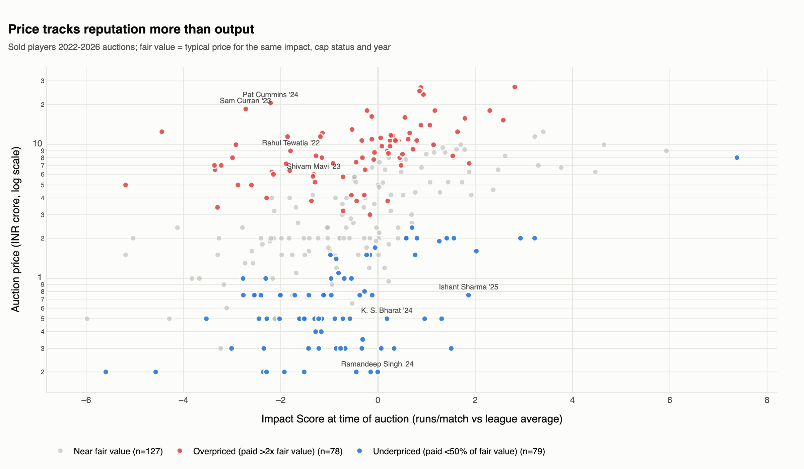
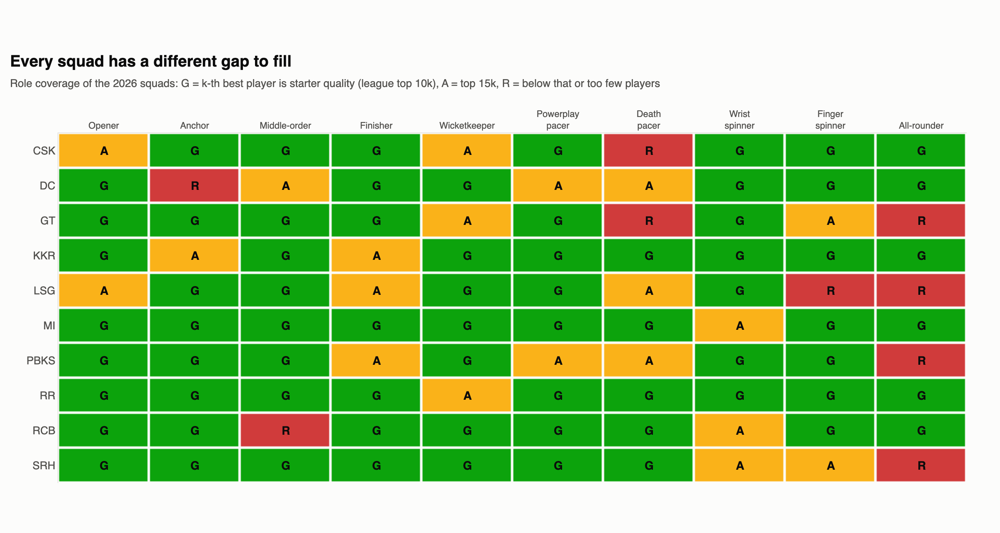

# IPL Auction War Room

**Key question:** *How should an IPL franchise rebuild its squad and spend its purse at the next auction to maximise wins and commercial value?*

**Live app:** https://ipl-auction-war-room-two.vercel.app

**Answer:** Spend on output, not reputation.
- Release the contracts whose output does not justify the salary.
- Fill the specific role gaps with players the market underprices, up to a hard bid ceiling.
- Treat the 2027 mini-auction as a bridge to the 2028 mega-auction, when every squad resets.

Built for **all 10 franchises**, each with its own priorities, and for both the IPL 2027 mini-auction and the IPL 2028 mega-auction.

## Three headline insights
1. **About 76% of a franchise's revenue is fixed central income.** Winning the title instead of missing the playoffs adds only ~Rs 40 cr (~6%). Wage discipline moves profit more than winning does: the recommended plans add **~Rs 23 cr** of expected operating profit on average, mostly from salary saved.
2. **The auction pays for reputation, not output.**
   - An international cap adds **157%** to a player's price; each extra run per match of real output adds only **24%**.
   - Wrist spinners and powerplay specialists sell ~17-18% below fair value. Anchors sell for 2.5x fair value and death specialists for 1.3x.
3. **Squad building works, but less than it looks.**
   - A team's runs-above-average explains **53%** of its win %.
   - Only **45%** of a planned improvement shows up the next season.
   - Recommended plans lift playoff odds by **+3 points** in the 2027 mini-auction (range 1-5 by team) and **+9 points** in a 2028 mega-auction.
   - So bid to a ceiling and always hold a backup.




## Deliverables
| What | Where |
|---|---|
| **Web app ("Auction War Room")**: one war room per franchise, Player Finder, Market Explorer, 3D India map, live optimiser, deck viewer and downloads | `web/` (React) + `api/` (FastAPI). Run locally, see below |
| **Consulting deck**: 14 slides with action titles, one per franchise (CSK is the illustrative client) | `outputs/deck/auction_war_room_<TEAM>.pptx` (+ PDF) |
| **Franchise P&L model**: live formulas, team selector, 3 scenarios, Python-vs-Excel check | `outputs/excel/franchise_model.xlsx` |
| **Squad optimiser for Excel Solver**: one workbook per team, pre-loaded with the PuLP answer | `outputs/excel/squad_optimiser_<TEAM>.xlsx` |
| **Recommendations**: Buy / Retain / Release, fair value, bid ceiling, rationale, risk, backup | `data/processed/recommendations.csv` |
| **Methodology and sources**: every method in plain English; every external figure cited | `docs/methodology.md`, `docs/sources.md` |

## How it works (one line each)
- **Impact Score**: runs a player adds per match versus a league-average player in the same phase and season. Wickets are valued with a run-expectancy table: 12.6 runs in the powerplay, 1.8 at the death.
- **Fair value**: the typical auction price for the same output, cap status and year (284 sales, 2022-26). **Likely price** adds the previous contract as a reputation proxy.
- **Squad gaps**: data-driven roles (opener, finisher, death pacer, wrist spinner...), rated Green / Amber / Red against the league.
- **Team priorities**: the gaps, how the home ground plays (spin vs pace, death-over scoring), the 2026 finish and squad age.
- **Optimiser**: an integer program that picks the best-value squad within the purse, squad size, overseas and retention rules. Results are stress-tested at +10/20/30% rival bidding.
- **Impact chain**: squad strength → win % → playoff chance → probability-weighted P&L.

## Get the raw data (not stored in the repo)
```bash
mkdir -p data/raw/cricsheet data/raw/geo
curl -L -o data/raw/cricsheet/ipl_male_csv2.zip https://cricsheet.org/downloads/ipl_male_csv2.zip
unzip -q data/raw/cricsheet/ipl_male_csv2.zip -d data/raw/cricsheet/ipl_csv2
curl -L -o data/raw/geo/india-composite.geojson https://cdn.jsdelivr.net/gh/datameet/maps@master/Country/india-composite.geojson
```
Auction tables, player bios and the Cricsheet player register are already included under `data/raw/`.

## Run it
```bash
python3.11 -m venv .venv && .venv/bin/pip install -r requirements-dev.txt
.venv/bin/python -m src.pipeline              # data -> valuation -> market -> gaps -> optimiser (~1 min)
.venv/bin/python -m src.build_excel           # Excel P&L + Solver workbooks
.venv/bin/python -m src.charts                # PNG charts
.venv/bin/python -m src.build_deck --all      # ten decks (python-pptx)
.venv/bin/python -m src.publish_downloads     # PDFs (via PowerPoint on macOS), slide images, downloads for the site
.venv/bin/python -m src.export_web            # JSON for the app
.venv/bin/python -m pytest -q                 # 32 tests

.venv/bin/uvicorn api.index:app --port 8000    # live optimiser + P&L API
cd web && npm install && npm run dev          # http://localhost:5180
```
Team logos: originals go in `web/logo-src/`; `python -m src.prepare_logos` removes flat backgrounds and sizes them evenly into `web/public/logos/`. Missing ones fall back to an original crest. Deployed on Vercel: the React site as static files and `api/index.py` as a Python serverless function (`vercel.json`).

## Limitations (stated honestly)
- Auction prices reflect bidding dynamics; Wikipedia lists sold players only, so unsold players are missing from the market model.
- The Impact Score ignores fielding, captaincy and opposition strength. Small samples are shrunk toward average, which under-rates breakout players.
- Franchise financials are largely assumptions, calibrated to Houlihan Lokey's "top franchises earn Rs 650-700 cr". Every assumption is flagged in `config/assumptions.yaml`.
- Each team is optimised alone: rivals do not react, so several plans can chase the same released players.
- The 2027 purse and all 2028 mega-auction rules were unannounced on 3 Oct 2026 and are assumptions (`config/rules.yaml`). Re-run after the 15 Nov retention deadline.

## Data sources
- Cricsheet ball-by-ball data: 1,243 IPL matches, 2008 to 31 May 2026.
- Wikipedia IPL personnel-change tables, 2022-26 (citing ESPNcricinfo and IPLT20).
- Media-rights, sponsorship and prize-money reports.
- Houlihan Lokey IPL Valuation Study 2025.
- datameet India boundary (CC BY 4.0).

Full list with dates in `docs/sources.md`. This is a hypothetical engagement, not affiliated with the IPL or any franchise.
